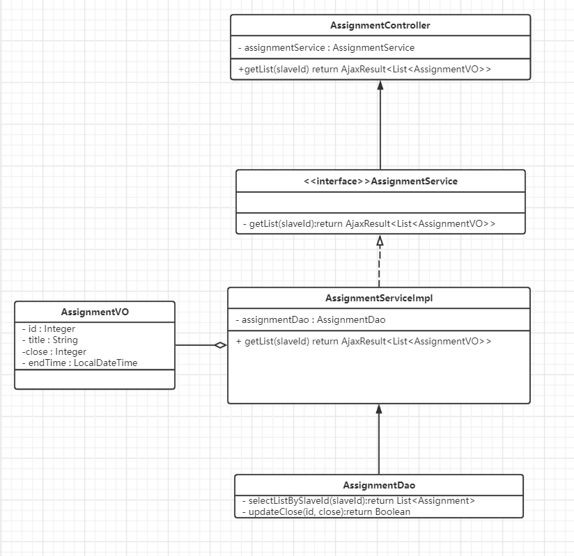
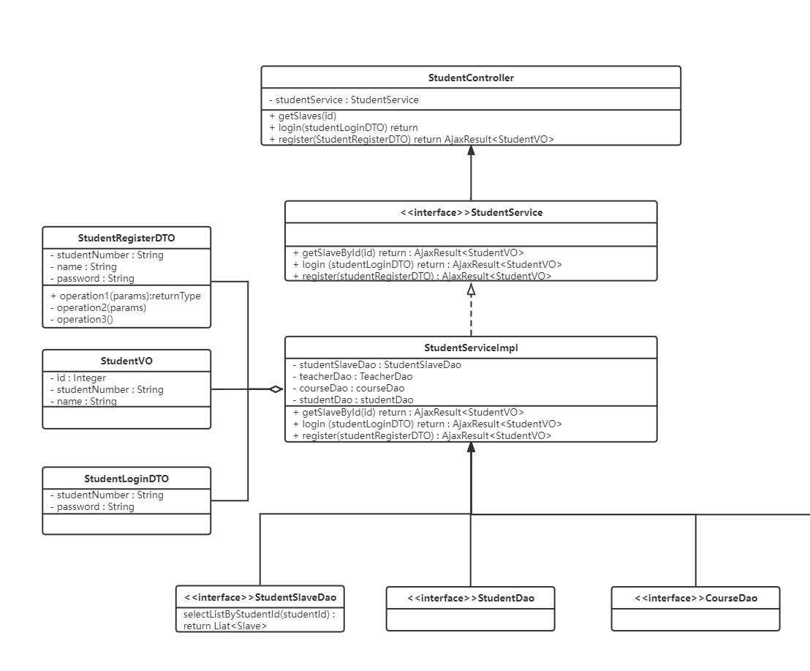
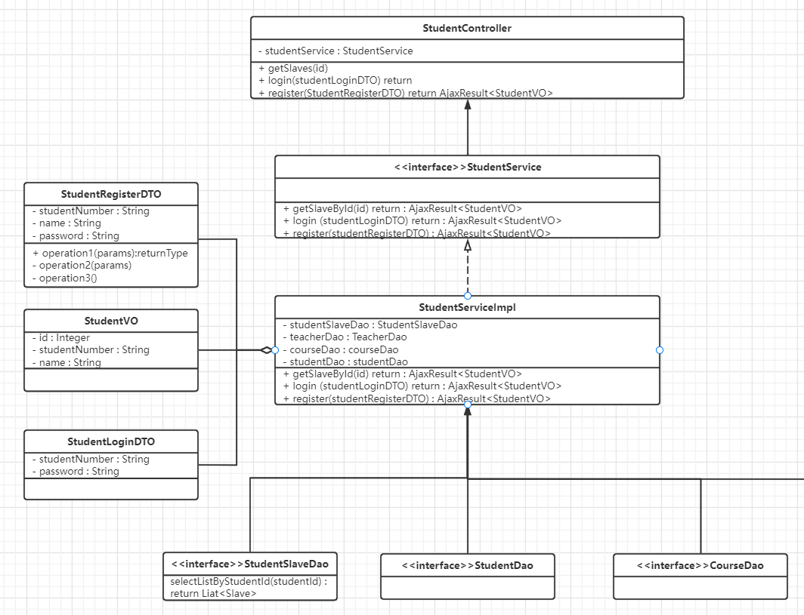
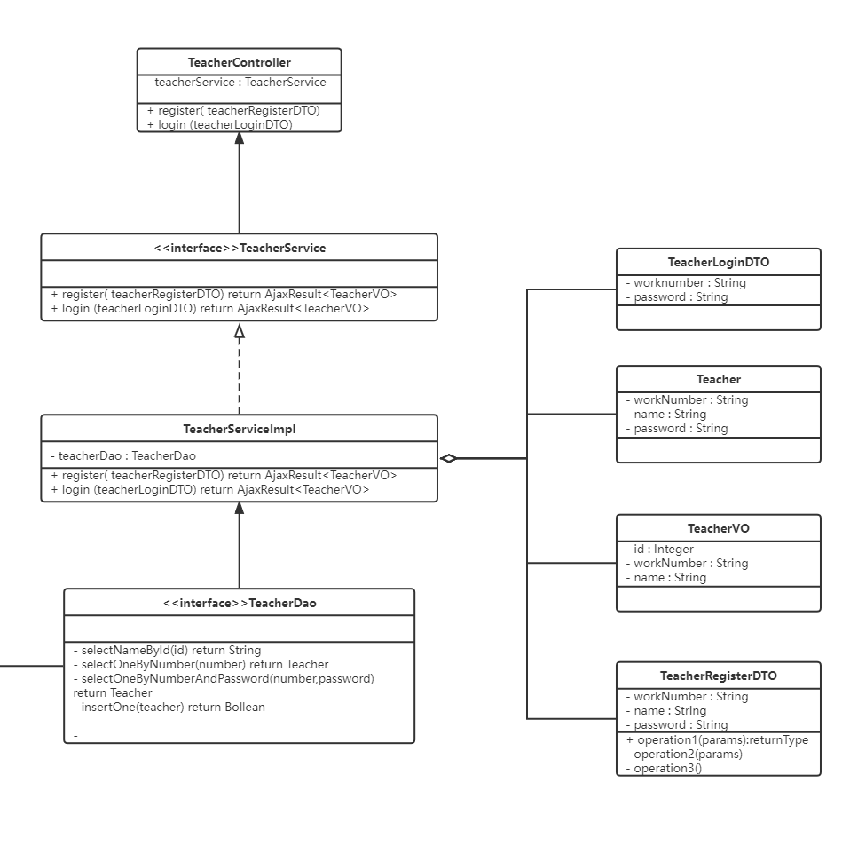
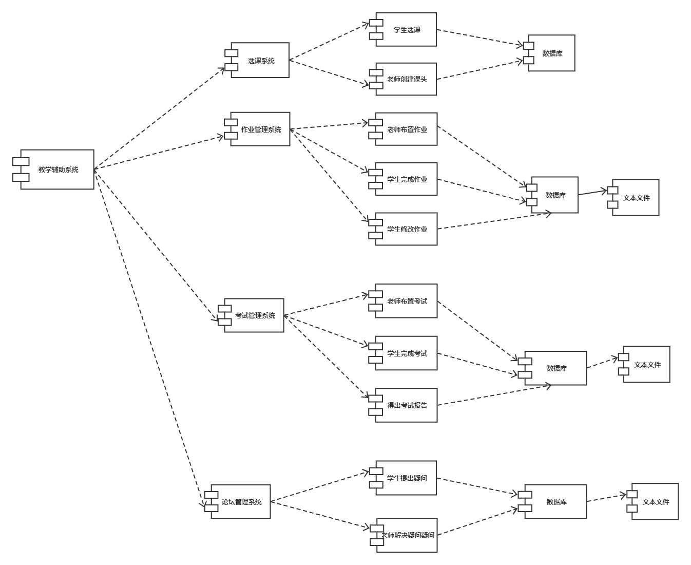

# 概要设计

## 系统概述

StudyHub是一个从校园师生切身需求出发，集在线作业、在线考试、师生论坛等课程管理功能于一体的综合教学平台。StudyHub是一个前后端分离的Web应用程序，前端主要使用`Vue`开发，后端主要使用`SpringBoot`开发，数据库使用`Mysql`。

## 运行环境

### 软件环境

|            | **名称** | **版本**                               |
| ---------- | -------- | -------------------------------------- |
| 操作系统   | Windows  | 10                                     |
| 数据库平台 | MySql    | 8.0.24                                 |
| 应用平台   | Java      | JDK8                                  |
| 客户端软件 | Chrome   | 99.0.4844.82 (Official Build) (64-bit) |

### 硬件环境

| 服务器                   | 最低配置                     | 推荐配置 |
| ------------------------ | ---------------------------------------- | ------------ |
| 应用服务器应用服务器     | CPU核心数：1；内存：2GB   | CPU核心数：2；内存：8GB |
| 数据库服务器数据库服务器 | CPU核心数：1；内存：2GB；数据容量：10GB | CPU核心数：2；内存：4GB；数据容量：500GB |

### 开发环境

- 前端： nodejs v8.11.1
- 后端： java1.8 + springboot2.0 + mysql8.0.24
- 其他： maven3.5 + git2.18.1

## 关键技术与算法

StudyHub是一个标准的web项目，采用的是浏览器/服务器架构。开发阶段用git进行版本迭代，后端基于springboot开发，mysql数据库存储数据，前端使用vue框架，前后端采用swagger来交接。

+ 前端：项目前端采用vue3.0技术开发。Vue3.0从20年九月发布第一个One Piece版本，到现在一直在更新优化。具有性能优化、支持摇树优化、组合API、新增的组件、更好的TypeScript支持、自定义渲染器在性能方面等诸多优点。对比Vue2.x，性能提升了1.3~2倍左右；打包后的体积也更小了。
+ 后端：后端采用了springboot作为框架。Spring Boot是由Pivotal团队提供的全新框架，其设计目的是用来简化新Spring应用的初始搭建以及开发过程。该框架使用了特定的方式来进行配置，从而使开发人员不再需要定义样板化的配置。
+ 数据库：数据库采用的是mysql关系型数据库管理系统。MySQL是一种关系型数据库管理系统，关系数据库将数据保存在不同的表中，而不是将所有数据放在一个大仓库内，这样就增加了速度并提高了灵活性。MySQL所使用的 SQL 语言是用于访问数据库的最常用标准化语言。MySQL 软件采用了双授权政策，分为社区版和商业版，由于其体积小、速度快、总体拥有成本低，尤其是开放源码这一特点，一般中小型和大型网站的开发都选择 MySQL 作为网站数据库。

## 系统功能设计

### 物理视图

studyhub项目采用了前后端分离的设计，前端为用户返回界面，而后端提供json形式的数据。其中系统的数据（用户信息，作业考试记录、答疑记录等）保存在后端服务器的数据库中。具体如以下网络拓扑图所示： 

### 逻辑视图  

(1)IssueSolveRecord部分

 

(2)Student部分

 

(3)Teacher部分

 

(4)Assignment部分

 

(5)Issue部分

 

### 开发视图

 

## 过程视图

下面通过过程视图（包括UML中的状态图、顺序图、活动图）来展示功能设计流程。 

### 用户信息模块 

首先是用户对个人信息的操作和管理，主要包括了用户登录功能，以及修改账号密码的功能。在这里我们认为用户首先需要输入正确的密码，才能对密码进行修改。具体见顺序图： 

 

用户修改的个人信息的状态图如下： 

### 作业模块 

作业模块的主要操作是老师布置作业，学生完成作业，老师批改作业，学生查看批改情况。系统在这个过程中主要作用是帮助存储老师以及学生对作业进行的编辑，以及通知学生完成作业，还有老师批改作业等。具体见以下状态图和活动图。

#### 状态图

 

#### 活动图

### 考试模块 

作业模块的主要操作是老师设计试卷，学生在规定时间内完成考试，老师改卷，学生查看分数。系统在这个过程中主要作用是帮助存储老师以及学生对试卷进行的编辑，以及通知学生完成考试，还有老师及时改卷等。具体见以下状态图和活动图： 

#### 状态图

 

#### 活动图

### 答疑论坛模块

答疑论坛模块的主要操作是学生针对作业中的题目提出问题，该问题会被发布到论坛上，老师看到后可以进行答疑。系统主要对学生的问题进行存储以及论坛上展示，同时还要记录答疑信息。具体见以下状态图和活动图： 

#### 状态图

 

#### 活动图

### 期末汇总模块 

期末汇总模块是系统根据学生的考试情况自动生成的报告，老师可以在课头下查看，并下载到本地。具体见以下状态图和活动图。

#### 状态图

 

#### 活动图

## 非功能性设计

- 性能：将关键性的操作局部化到少量的构件中、一台计算机上。减少通信量。
      对大量数据的处理优化算法
      对sql语句进行优化，命中索引
      使用Redis，消息队列等中间件进行缓存、异步等应对高并发。
- 信息安全：层次化的体系结构，把最关键的资源放在最内层进行保护。
      对敏感信息在前后端进行加密处理和传输，有条件可以使用https。
      对用户进行身份验证、鉴权。
- 可用性：在版本迭代时采取灰度发布、平滑上线功能。
- 可维护性：尽量使用细粒度、自包含的构件，尽量避免共享数据结构。
      所有源码必须加上关键注释、不要过度注释。
      所有需求需要有单元测试。
      设计时尽量贴合高内聚低耦合。
- 可靠性：为了避免服务不可用、服务器宕机，可以搭建集群。

## 数据库设计

### 采用的数据库

MYSQL 8.0.24

### 数据库表的设计

#### 作业表：assignment  
| 字段 | 数据类型 | 是否可空 | 默认值 | 备注 |  
| :---:| :---:   | :---:   | :---:  | :---: |   
| id   | int     |  0      |  自增  |  主键，自增1 |  
|title | varchar |  1      | null   |    标题  |
|slave_id |           int|       0|      无|         课头id|  
|close|               int|       0|       0|          1到期0未到期|  
|end_time|            datetime|  0|       无|         deadline|  
|delete|              int|       0|       0|          逻辑删除| 
|create_time|         datetime|  0|       当前时间戳|  插入时间| 
|update_time|         datetime|  0|       当前时间戳|  更新时间| 

#### 课程表：course
| 字段 | 数据类型 | 是否可空 | 默认值 | 备注 |  
| :---:| :---:   | :---:   | :---:  | :---: |
|id|                  int|       0|       自增|       主键，自增1|
|name|                varchar|   1|       null|       名字|
|outline|             varchar|   1|       null|       大纲|
|delete|              int|       0|       0|          逻辑删除|
|create_time|         datetime|  0|       当前时间戳|  插入时间|
|update_time|         datetime|  0|       当前时间戳|  更新时间|

#### 问题表: issue
| 字段 | 数据类型 | 是否可空 | 默认值 | 备注 |  
| :---:| :---:   | :---:   | :---:  | :---: |
|id|                  int|       0|       自增|       主键，自增1|
|assignment_id|       int|       0|       无 |        作业id|
|index|               int|       0|       无 | |       序号|
|content|             varchar|   1|       null |      内容|
|goal|                分值|      0|       0.0 |       分值|
|delete|              int|       0 |      0|          逻辑删除|
|create_time|         datetime|  0|       当前时间戳|  插入时间|
|update_time|         datetime|  0|       当前时间戳 | 更新时间|

#### 问题解答记录表:issue_solve_record
| 字段 | 数据类型 | 是否可空 | 默认值 | 备注 |  
| :---:| :---:   | :---:   | :---:  | :---: |
|id             |     int   |    0    |   自增    |   主键，自增1|
|student_id    |      int  |     0   |    无    |     学生id|
|issue_id      |      int   |    0   |    无   |      问题id|
|content      |       varchar|   1   |    null  |     内容|
|correct      |       int   |    0   |    0     |     1已批改|
|score        |       double  |  0   |    -1.00 |     得分|
|delete       |       int    |   0  |     0      |    逻辑删除|
|create_time   |      datetime  |0  |     当前时间戳  |插入时间|
|update_time   |      datetime | 0  |     当前时间戳 | 更新时间|

#### 课头表:slave
| 字段 | 数据类型 | 是否可空 | 默认值 | 备注 |  
| :---:| :---:   | :---:   | :---:  | :---: |
|id     |             int  |     0   |    自增  |     主键，自增1|
|slave_number |       varchar |  0  |     无  |       课头号|
|course_id    |       int  |     0   |    无   |      课程id|
|teacher_id   |       int  |     0  |     无   |      老师id|
|delete      |        int  |     0 |      0       |   逻辑删除|
|create_time   |      datetime | 0  |     当前时间戳 | 插入时间|
|update_time  |       datetime | 0  |     当前时间戳 | 更新时间|

#### 学生表:student
| 字段 | 数据类型 | 是否可空 | 默认值 | 备注 |  
| :---:| :---:   | :---:   | :---:  | :---: |
id         |         int     |  0 |      自增   |    主键，自增1|
student_number|      varchar |  0  |     无    |     学号|
name                varchar   0  |     无    |     姓名|
password   |         varchar |  0  |     无     |    密码|
delete     |         int     |  0  |     0      |    逻辑删除|
create_time  |       datetime|  0    |   当前时间戳|  插入时间|
update_time  |       datetime | 0   |    当前时间戳 | 更新时间|

#### 选课表:student_slave
| 字段 | 数据类型 | 是否可空 | 默认值 | 备注 |  
| :---:| :---:   | :---:   | :---:  | :---: |
id     |             int    |   0    |   自增   |    主键，自增1|
student_id |         int   |    0   |    无    |     学生id|
slave_id   |         int    |   0    |   无    |     课头id|
delete     |         int    |   0   |    0     |     逻辑删除|
create_time |        datetime | 0   |    当前时间戳  |插入时间|
update_time  |       datetime | 0   |    当前时间戳  |更新时间|

#### 老师表:teacher
| 字段 | 数据类型 | 是否可空 | 默认值 | 备注 |  
| :---:| :---:   | :---:   | :---:  | :---: |
id       |           int    |   0    |   自增   |    主键，自增1|
work_number    |     varchar |  0   |    无   |      工号|
name        |        varchar |  0   |    无    |     姓名|
password     |       varchar |  0   |    无   |      密码|
delete       |       int     |  0   |    0       |   逻辑删除|
create_time  |       datetime  |0   |    当前时间戳 | 插入时间|
update_time  |       datetime | 0   |    当前时间戳 | 更新时间|

## 人机交互设计

### 用户登录

分为学生和老师登录，可选择身份进入。

### 学生课程

学生登录后可以选择在修课头并进入课程首页。

### 学生作业

学生可以查看和编辑解答来完成作业。

### 学生考试

学生可以进入考试系统参加考试，解答单选题，并在剩余时间结束前点击提交。

### 学生课程论坛

学生可以在课程论坛查看所有帖子，发表自己的帖子，查看某个帖子详情并发表一级或二级回复，

### 老师作业管理

老师可以查看学生的作业解答并赋分。

### 老师作业管理

老师可以进入作业管理界面，进入后可以发布或者删除作业。

### 老师答疑

老师可以进入课程论坛并在学生发布的帖子下回复进行答疑。

