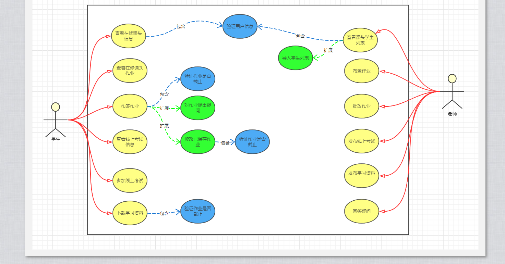
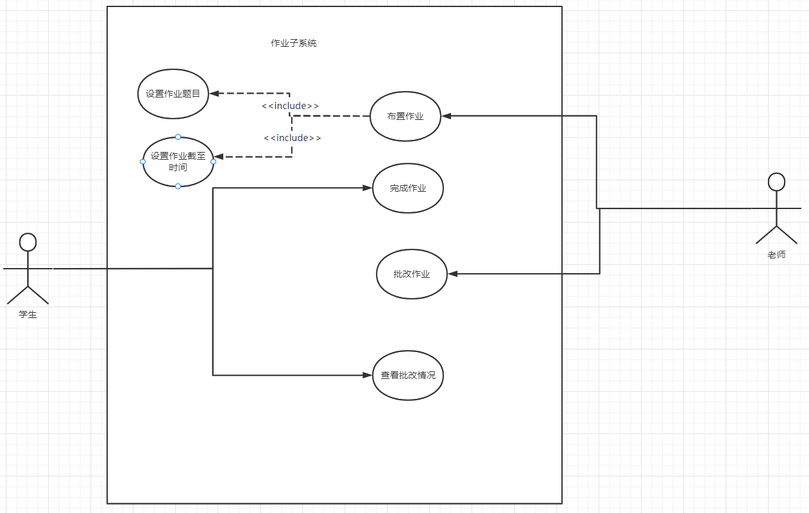
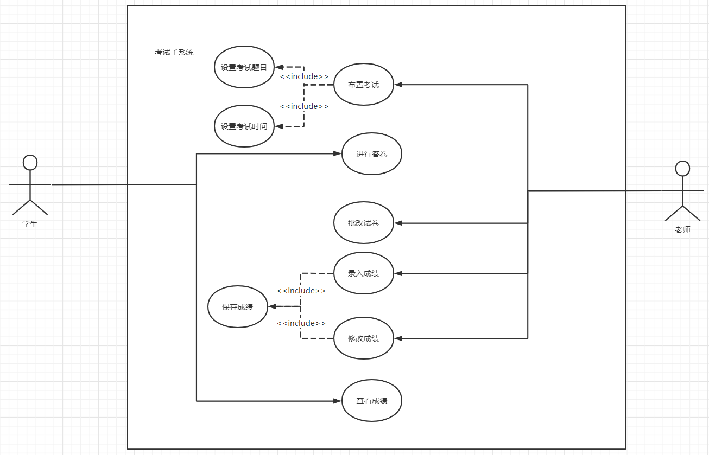
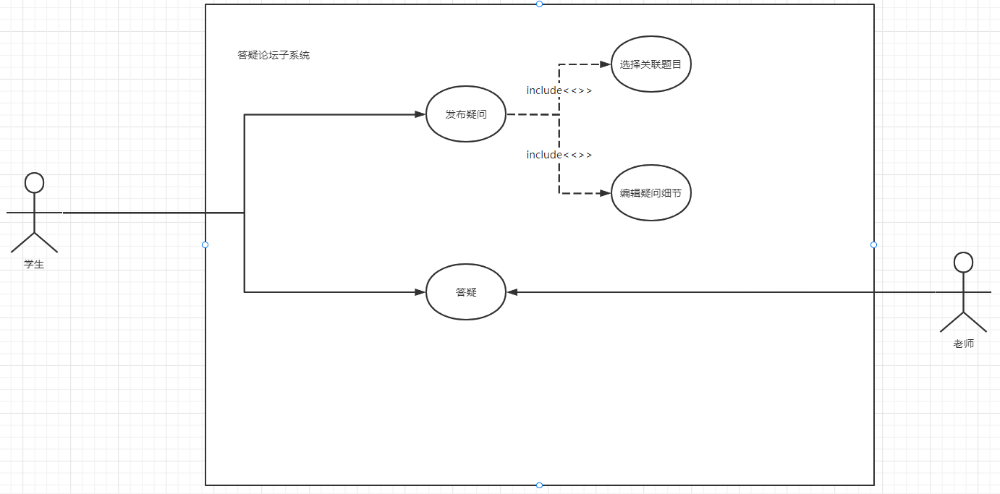
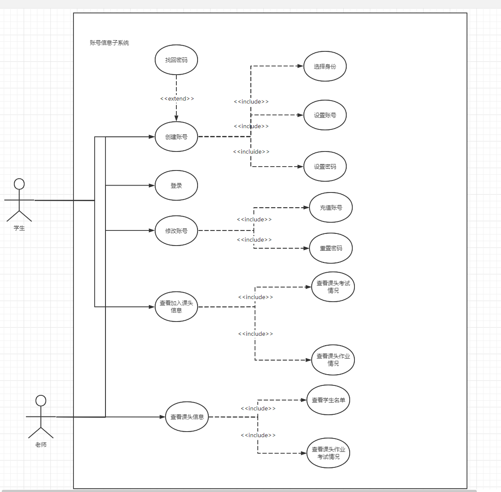

# 需求分析

## 1.系统概述
StudyHub是一个从校园师生切身需求出发，集在线作业、在线考试、师生论坛等课程管理功能于一体的综合教学平台。

## 2. 需求概述
### **2.1 目标**
+ 开发意图：StudyHub的开发是为了让老师的教学任务和学生的学习任务一体化，解决当下很多教学平台功能过于单一或者冗杂，无法很好地满足用户的需求的问题。
+ 应用目标：作为教学辅助工具。
+ 作用范围：有线上教学或者学习需求的师生。
  
### **2.2 运行环境**
  待定，因为还没又进入编码测试阶段，会在下一个迭代周期中注明。

### **2.3 利益相关者**
- 用户：学生，教师

### **2.4 用户需求**

系统用户有教师，学生两类。

- 学生
  + 查看已选课头信息，例如教师信息和教学大纲。
  + 及时收到来自该课头的老师发布的作业、考试和答疑通知。
  + 完成考试任务，在规定时间内修改和提交试卷。
  + 下载老师的课程资料，例如课程PPT以及网课录屏等。
  + 在截止日期前，修改或提交作业，并且能够对作业内容提出疑问。
  + 在老师完成批改后，看到自己作业情况以及老师的答疑。

- 教师
  + 在系统中创建若干个课头，每一项课头归属于一门课程。
  + 在课头中导入已选该课头的学生列表。
  + 在某课头下布置一项新作业，系统将作业消息通知给课头下全体学生。
  + 设定考试流程，试卷内容和考试时间。
  + 查看某作业下学生提出的疑问，做出回复。
  + 某作业截止日期后，收集某课头内全部作业，为每一份作业打分。
  + 期末时，进行成绩分类统计和试题难度分析。
  

### **2.5  用户特点**

  + 学生：学生的特点是随时需要对作业做出修改，系统需要对作业修改记录及时保存防止丢失。作业或者考试的提交方式也应该保持多样，应该提供文字、图片等方式。此外学生也需要确保收到通知，比如老师发布的作业和考试等。在作业截至的前一天，编辑作业的人数会有显著的提高，此时对系统的并发量有一定的需求。
  
  + 教师：教师用户有布置作业，和考试的需求，系统需要提供较为友好的界面，并且能够支持多种作业形式（如文字题目，或者其他文件等等）。此外，教师希望在作业或者考试规定的时间之后，能够收到通知批改学生的提交内容，并能给出打分，及时告知学生查看。
  
### **2.6 关键点**
+ 关键功能：在线作业、在线考试、师生论坛。
+ 关键算法：待定，还未到代码实现阶段。
+ 关键技术：开发阶段用git进行版本迭代，后端基于springboot开发，mysql数据库存储数据，前端使用vue框架，前后端采用swagger来交接。

  
## 3.运行环境
### **3.1软件环境**

| | 名称 | 版本|
| :----: |:----: |:----: |
|操作系统|windows|10|
|数据库平台|Mysql|8.0.24|
|客户端软件|Chrome|99.0.4844.82 (Official Build) (64-bit)|

### **3.2硬件环境**
待定，项目暂未进入编码阶段，部署完成后可以确定硬件环境。
  

## 4.需求规定
###  **4.1软件系统总体功能结构**
   整个系统又4个主要的功能模块构成，分别为登录模块、作业模块、答疑论坛模块、考试模块。

### **4.2功能需求**
+ 登录模块：用户登录模块是用户进入系统的入口，用户登录时要经过身份验证，只有本校在读学生和教职工才可以登录本系统。本系统有学生、老师两种用户角色，根据其身份及作用的不同，通过ID和密码验证用户的身份，对不同级别的用户系统自动调用不同的可访问页面，使用系统提供的与其身份相应的各项功能，其他用户只可以浏览公开信息。

+ 作业模块：作业模块由作业布置、作业提交、作业批改组成。老师选定某课头的作业，编辑作业内容，设置截止时间。系统将该次作业分发给该课头下的学生。学生选择某课头的作业，编辑内容并保存提交，在截止日期前可对作业进行反复修改。某作业截止日期后，系统收集某课头内全部作业，老师为每一份作业打分。

+ 答疑论坛模块：系统以论坛的形式将学习中的问题进行分类管理，便于学生期末进行整理和复习。老师可以通过论坛掌握学习情况，以便针对性的讲授课程内容，或者以老师身份直接参与到论坛交流中。学生可以发布与作业相关联的帖子，其他学生和教师可以回复答疑，关注帖子。

+ 考试模块：由学生考试、成绩汇报组成。学生考试需要在规定的考试时间完成。系统根据当前学期的开
#### 总用例图：

#### 子用例图：
+ 作业模块
  
+ 考试模块
 
+ 师生答疑模块
  
+ 账号信息模块
  

#### 顺序图：
 
#### 数据流图：
 

### **4.3非功能需求**
- 性能需求 
  + 由于该系统可能同时在线较多的师生用户，所有应该有较好的并发性能。
  + 用户需要在系统上编辑文本等操作，因此要有比较短的反应延迟，提升用户体验。
- 可靠性需求
  + 由于该系统设计学生考试成绩，所以应该具有良好的安全性，可靠性和可维护性，能够长时间无故障运行。
- 可用性需求
  + 系统的实时性要求很高，因此版本迭代时考虑采取灰度发布。
- 开发性需求
  + 系统应具有相当的灵活性和稳定性，能够很好的适应信息管理的多边形。
- 可扩展性需求
  + 在开发阶段会有多次迭代，根据用户需求和反馈改进功能，所以功能的扩展性要强。 
- 可维护性需求：
  + 可理解性：源码应有注释
  + 可测试性：每个需求应有单元测试
  + 可修改性：符合高内聚低耦合原则

