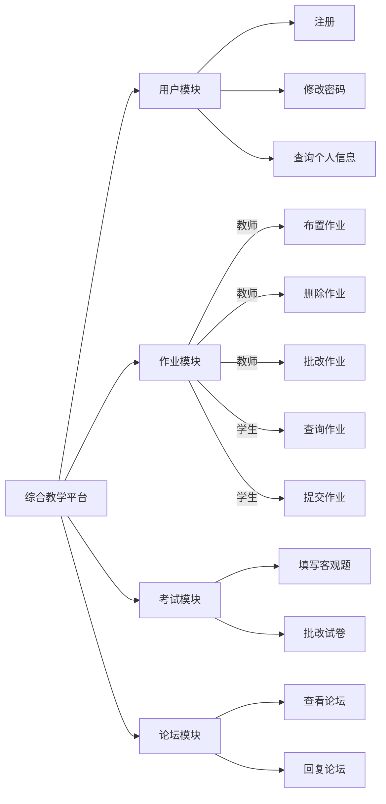
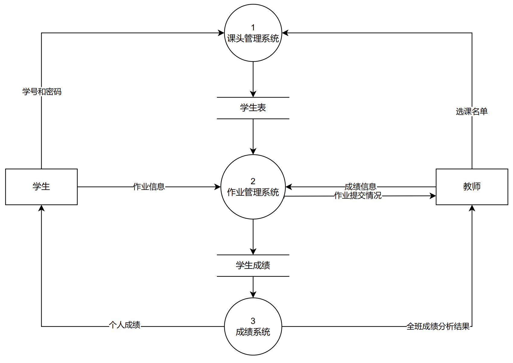
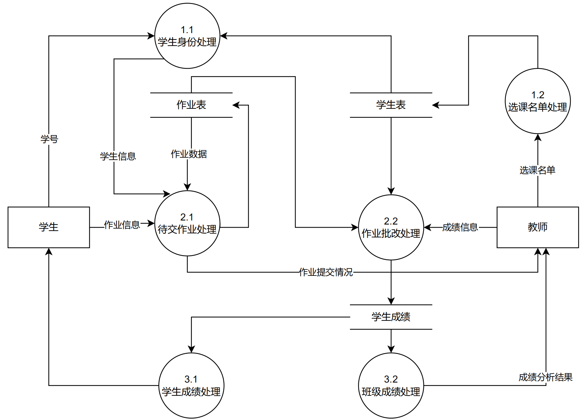

# 需求分析

## 系统概述

StudyHub是一个从校园师生切身需求出发，集在线作业、在线考试、师生论坛等课程管理功能于一体的综合教学平台。StudyHub是一个前后端分离的Web应用程序，前端主要使用`Vue`开发，后端主要使用`SpringBoot`开发，数据库使用`Mysql`。

## 需求概述

### 目标

+ 开发意图：StudyHub的开发是为了让老师的教学任务和学生的学习任务一体化，解决当下很多教学平台功能过于单一或者冗杂，无法很好地满足用户的需求的问题。
+ 应用目标：作为教学辅助工具。
+ 作用范围：有线上教学或者学习需求的师生。

### 用户特点

#### 利益相关者

- 学生
- 教师

#### 用户需求

- 学生
  + 查看已选课头信息，例如教师信息和教学大纲。
  + 及时收到来自该课头的老师发布的作业、考试和答疑通知。
  + 完成考试任务，在规定时间内修改和提交试卷。
  + 下载老师的课程资料，例如课程PPT以及网课录屏等。
  + 在截止日期前，修改或提交作业，并且能够对作业内容提出疑问。
  + 在老师完成批改后，看到自己作业情况以及老师的答疑。

- 教师
  + 在系统中创建若干个课头，每一项课头归属于一门课程。
  + 在课头中导入已选该课头的学生列表。
  + 在某课头下布置一项新作业，系统将作业消息通知给课头下全体学生。
  + 设定考试流程，试卷内容和考试时间。
  + 查看某作业下学生提出的疑问，做出回复。
  + 某作业截止日期后，收集某课头内全部作业，为每一份作业打分。
  + 期末时，进行成绩分类统计和试题难度分析。
  
#### 特点描述

  + 学生：学生的特点是随时需要对作业做出修改，系统需要对作业修改记录及时保存防止丢失。作业或者考试的提交方式也应该保持多样，应该提供文字、图片等方式。此外学生也需要确保收到通知，比如老师发布的作业和考试等。在作业截至的前一天，编辑作业的人数会有显著的提高，此时对系统的并发量有一定的需求。
  
  + 教师：教师用户有布置作业，和考试的需求，系统需要提供较为友好的界面，并且能够支持多种作业形式（如文字题目，或者其他文件等等）。此外，教师希望在作业或者考试规定的时间之后，能够收到通知批改学生的提交内容，并能给出打分，及时告知学生查看。

### 关键点

#### 关键功能

- 在线作业
- 在线考试
- 师生论坛

#### 关键算法与技术

StudyHub是一个标准的web项目，采用的是浏览器/服务器架构。开发阶段用git进行版本迭代，后端基于springboot开发，mysql数据库存储数据，前端使用vue框架，前后端采用swagger来交接。

+ 前端：项目前端采用vue3.0技术开发。Vue3.0从20年九月发布第一个One Piece版本，到现在一直在更新优化。具有性能优化、支持摇树优化、组合API、新增的组件、更好的TypeScript支持、自定义渲染器在性能方面等诸多优点。对比Vue2.x，性能提升了1.3~2倍左右；打包后的体积也更小了。
+ 后端：后端采用了springboot作为框架。Spring Boot是由Pivotal团队提供的全新框架，其设计目的是用来简化新Spring应用的初始搭建以及开发过程。该框架使用了特定的方式来进行配置，从而使开发人员不再需要定义样板化的配置。
+ 数据库：数据库采用的是mysql关系型数据库管理系统。MySQL是一种关系型数据库管理系统，关系数据库将数据保存在不同的表中，而不是将所有数据放在一个大仓库内，这样就增加了速度并提高了灵活性。MySQL所使用的 SQL 语言是用于访问数据库的最常用标准化语言。MySQL 软件采用了双授权政策，分为社区版和商业版，由于其体积小、速度快、总体拥有成本低，尤其是开放源码这一特点，一般中小型和大型网站的开发都选择 MySQL 作为网站数据库。

## 运行环境

### 软件环境

| | 名称 | 版本|
| :----: |:----: |:----: |
|操作系统|Windows|10|
|数据库平台|Mysql|8.0.24|
|应用平台|Java|JDK8|
|客户端软件|Chrome|99.0.4844.82 (Official Build) (64-bit)|

### 硬件环境

| 服务器                   | 最低配置                     | 推荐配置 |
| ------------------------ | ---------------------------------------- | ------------ |
| 应用服务器应用服务器     | CPU核心数：1；内存：2GB   | CPU核心数：2；内存：8GB |
| 数据库服务器数据库服务器 | CPU核心数：1；内存：2GB；数据容量：10GB | CPU核心数：2；内存：4GB；数据容量：500GB |

## 需求规定

### 软件系统总体功能结构

整个系统由4个主要的功能模块构成，分别为用户模块、作业模块、答疑论坛模块、考试模块。

#### 系统功能结构图

#### 功能需求

+ 登录模块：用户登录模块是用户进入系统的入口，用户登录时要经过身份验证，只有本校在读学生和教职工才可以登录本系统。本系统有学生、老师两种用户角色，根据其身份及作用的不同，通过ID和密码验证用户的身份，对不同级别的用户系统自动调用不同的可访问页面，使用系统提供的与其身份相应的各项功能，其他用户只可以浏览公开信息。

+ 作业模块：作业模块由作业布置、作业提交、作业批改组成。老师选定某课头的作业，编辑作业内容，设置截止时间。系统将该次作业分发给该课头下的学生。学生选择某课头的作业，编辑内容并保存提交，在截止日期前可对作业进行反复修改。某作业截止日期后，系统收集某课头内全部作业，老师为每一份作业打分。

+ 答疑论坛模块：系统以论坛的形式将学习中的问题进行分类管理，便于学生期末进行整理和复习。老师可以通过论坛掌握学习情况，以便针对性的讲授课程内容，或者以老师身份直接参与到论坛交流中。学生可以发布与作业相关联的帖子，其他学生和教师可以回复答疑，关注帖子。

+ 考试模块：由学生考试、成绩汇报组成。学生考试需要在规定的考试时间完成。系统根据当前学期的开

### 用例图与用例规约

#### 总用例图

#### 子用例图

##### 作业模块

  

###### 完成作业用例

- 用例名称:完成作业
- 参与者：学生
- 简要说明: 学生能够对老师布置的作业进行作答
- 前置条件: 老师已经布置作业，且作业还未截至。
- 基本事件流：
  1. 选择作业
  2. 选择题目作答
  3. 点击保存暂存作业
- 后置条件：学生的作业在截至日期到达后自动提交给老师

###### 查看已完成作业情况用例

- 用例名称:查看已完成作业情况
- 参与者：学生
- 简要说明: 学生可以对自己之前完成的作业进行查看
- 前置条件: 存在已完成作业，作业已经到期且被批改
- 基本事件流：
  1. 点击历史作业
  2. 点击具体作业，查看作业作答以及老师给分
- 后置条件：学生获取历史作业信息

###### 布置作业用例

- 用例名称:布置作业
- 参与者：老师
- 简要说明: 老师可以布置作业给所有学生完成
- 前置条件: 用户以老师身份登录
- 基本事件流：
  1. 点击新建作业
  2. 设置开始截至时间
  3. 设置题型以及题目内容
  4. 确认发布
- 后置条件：所有课头下学生收到作业

##### 考试模块

 

###### 批改试卷用例

- 用例名称:批改试卷
- 参与者：老师
- 简要说明: 老师可以对学生完成的试卷进行批改
- 前置条件: 用户以老师身份登录，且考试已经结束
- 基本事件流：
  1. 点击考试
  2. 查看学生作答，给出分数
- 后置条件：考试变为已批改，且学生可以查看分数

##### 师生答疑模块

  

###### 论坛提问用例

- 用例名称:论坛提问
- 参与者：老师、学生
- 简要说明: 老师和学生可以在论坛提出自己感兴趣的问题
- 前置条件: 用户是该课头的老师或者学生，且该课头论坛开放
- 基本事件流：
  1. 点击论坛
  2. 点击新建帖子
  3. 输入问题
  4. 点击发布
- 后置条件：该课头论坛所有用户可以看到该问题，并且回复

###### 论坛回答用例

- 用例名称:论坛回答
- 参与者：老师、学生
- 简要说明: 老师和学生可以对论坛下的问题或回答进行回复
- 前置条件: 该问题未被提出者删除
- 基本事件流：
  1. 选择问题或者回复
  2. 输入回复
  3. 点击发表
- 后置条件：其他所有课头下用户可以看到该回复

##### 账号信息模块

###### 登录系统用例

- 用例名称:登录系统
- 参与者：学生、老师
- 简要说明: 用户身份无论为学生还是老师都需要进行登录，才能使用系统功能
- 前置条件:数据库中存有该用户信息，能够验证 
- 基本事件流：
  1. 输入学号\工号
  2. 点击确认
  3. 系统根据数据库信息验证
- 例外：该用户不存在
- 后置条件：成功登录

### 用户故事

#### 作为一个学生，我想要进行查看课程相关信息，并完成所有学习任务（作业、考试等）

  + 描述：作为一个学生，我想要查看已选课头信息，例如教师信息和教学大纲；及时收到来自该课头的老师发布的作业、考试和答疑通知；完成考试任务，在规定时间内修改和提交试卷；下载老师的课程资料，例如课程PPT以及网课录屏等；在截止日期前，修改或提交作业，并且能够对作业内容提出疑问；在老师完成批改后，看到自己作业情况以及老师的答疑；教师。
  + 验收标准
    + 登陆时，使用自己的学号和密码进行登录
    + 选择自己当前参加的所有课程，点击后可以看到该课程的主页面
    + 点击作业按钮，可以在当前作业栏看到所有需要现在完成的作业，点击具体作业可以作答，点击保存按钮将作答暂存。点击历史作业可以看到已经截至的作业，并查看自己的提交情况
    + 点击考试按钮，可以在考试栏看到所有需要进行的考试，点击具体作业可以作答，点击提交按钮将试卷提交。到达截止时间还没提交将强制提交，停止作答。
    + 点击论坛可以查看课头论坛，可以在输入框对任意问题或者回答进行回复。点击提出问题可以在论坛提出自己的问题。

#### 作为一个老师，我想要布置作业、考试，批改作业、试卷，收集和回答学生的疑问。

  + 描述：作为一个老师，我想在系统中创建若干个课头，每一项课头归属于一门课程；在课头中导入已选该课头的学生列表；在某课头下布置一项新作业，系统将作业消息通知给课头下全体学生；设定考试流程，试卷内容和考试时间；查看某作业下学生提出的疑问，做出回复；某作业截止日期后，收集某课头内全部作业，为每一份作业打分；期末时，进行成绩分类统计和试题难度分析。
  + 验收标准
    +  登陆时，使用自己的工号和密码进行登录
    +  选择自己当前教学的所有课程，点击后可以看到该课程的主页面
    +  点击作业按钮，可以在待批改作业栏看到所有还未批改的作业，点击具体作业可以看到学生的具体作答，点击翻页按钮可以看到不同学生的作答情况，并且为每一个学生的作答给出分数。点击已批该作业可以看到已经批改的作业，并查看自己的给分情况，同时能够做出修改。
    +  点击新建作业按钮，可以布置新作业，设置作业的开始截至时间，设置作业的题型以及内容。
    +  点击考试按钮，可以看到学生的考试情况，点击具体考试可以看到学生的试卷，点击翻页按钮可以看到不同学生的试卷情况，并且为每一个学生给出分数。点击已批该试卷可以看到已经批改的考试，并查看自己的给分情况，同时能够做出修改。
    +  点击新建考试按钮，可以布置新试卷，设置考试的开始截至时间以及考试时长，设置考试的题型以及内容。
    +  点击论坛可以查看课头论坛，可以在输入框对任意问题或者回答进行回复。点击提出问题可以在论坛提出自己的问题。

### 场景描述

#### 学生角色

小王同学正在学习软件工程课程，在经过线下学习后，老师布置了一些练习。小王同学打开浏览器访问StudyHub网站，输入自己的学号和密码进行登录，然后在当前参加的课程中选中软件工程。进入课程首页，他首先想要完成老师的作业。他点击待完成作业后查看到了正在进行的作业以及截止时间，然后开始对作业中的每一道题目进行作答。作答完毕后点击小王保存，然后他想起来之前老师说过之后会有一次小测试，所以他点开了历史作业，开始查看以往的作业提交记录，以此来复习所学知识。在这个过程中他遇到了一些解决不了的问题，所以他点击了论坛按钮进入到了课头论坛，然后再论坛中提出问题，以供其他同学进行解答。在浏览论坛的过程中他发现有一位同学的问题他有一些自己的见解，于是点击回复框进行了回复。完成后他退出了系统。一段时间后开始了线上测试，小王登录后点击在线考试，看到了时间以及剩余时间、作答进度等信息，然后开始作答。在规定时间内，他完成了试卷并进行了提交。

#### 教师角色

刘老师是一位软件工程老师，他手下有很多课头。现在，刘老师打开浏览器访问StudyHub网站，输入自己的工号和密码进行登录。首先他需要对上周的作业进行批改。点击待批改作业，刘老师看到了班上30位同学的作答情况，通过翻页按钮可以查看不同学生的作业，并在输入框中输入学生的分数。完成作业的批改后，他又点击已批该作业，检查刚刚批改情况有无问题。结束后，刘老师开始布置下一周的测验。他点击新建作业按钮，设置好了考试的开始结束时间，以及考试时长，然后开始选择题型，输入题目的具体内容。结束后刘老师点击发布。然后刘老师点击论坛按钮，他发现不少同学有一些问题，于是点击回复框进行了回复。随后根据上周教学内容提出了一个问题供大家讨论。完成这些操作后，刘老师退出了系统。

### 顺序图

 

### 数据流图

#### 1层数据流图

 

#### 2层数据流图

 

### 非功能需求

- 性能需求 
  + 由于该系统可能同时在线较多的师生用户，所有应该有较好的并发性能。
  + 用户需要在系统上编辑文本等操作，因此要有比较短的反应延迟，提升用户体验。
- 可靠性需求
  + 由于该系统设计学生考试成绩，所以应该具有良好的安全性，可靠性和可维护性，能够长时间无故障运行。
- 可用性需求
  + 系统的实时性要求很高，因此版本迭代时考虑采取灰度发布。
- 开发性需求
  + 系统应具有相当的灵活性和稳定性，能够很好的适应信息管理的多边形。
- 可扩展性需求
  + 在开发阶段会有多次迭代，根据用户需求和反馈改进功能，所以功能的扩展性要强。 
- 可维护性需求：
  + 可理解性：源码应有注释
  + 可测试性：每个需求应有单元测试
  + 可修改性：符合高内聚低耦合原则